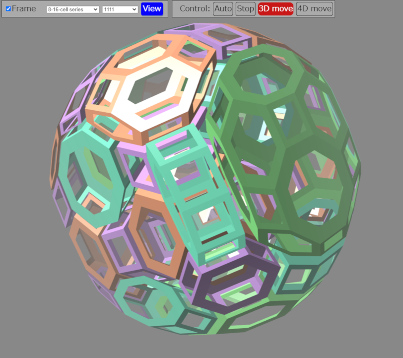

# ４次元多胞体ビューワー

[English version is here](README.md)

これはtypescriptとthree.jsで書かれた４次元多胞体ビューワーです。４次元凸一様多胞体のほとんどを見ることができます。

## 始めよう

1. [ここに行く](https://satshi.github.io/app/)
2. "View"ボタンを押す

すると回転している４次元立方体が見れます。

## 次に

### 操作

"Control" のところにあるボタンを押すことで操作のモードを変えることができます。

* Auto: 自動的に回ります。
* Stop: 静止します。
* 3D move: マウスのドラッグで３次元空間内で回転できます。
* 4D move: マウスのドラッグで４次元空間内で回転できます。

### 別の多胞体

1. 左のドロップダウンリストから、多胞体のクラスを選ぶ。
2. 右のドロップダウンリストから、多胞体を選ぶ。
3. "View" ボタンを押す。

すると選んだ多胞体が見れます。

### フレーム表示

"Frane"のチェックボックスをチェックして"View"ボタンを押すと、フレーム表示（各面の枠が表示される）になります。

## 多胞体について
Wikipediaのページ [Uniform 4-polytope](https://en.wikipedia.org/wiki/Uniform_4-polytope) に良い説明があります。このアプリの中の多胞体の名前で、"**-cell series" にあるものはCoxeter図に基づいています。 このアプリで0はCoxeter図で●に対応し、このアプリで1はCoxeter図で◉に対応します。つまり、例えばこのアプリで0101はCoxeter図●－◉－●－◉に対応します。 このアプリで"Snub"は ◯－◯－◯－◯に対応します。

## その他の情報

[多胞体のJSONフォーマット](format.md)
