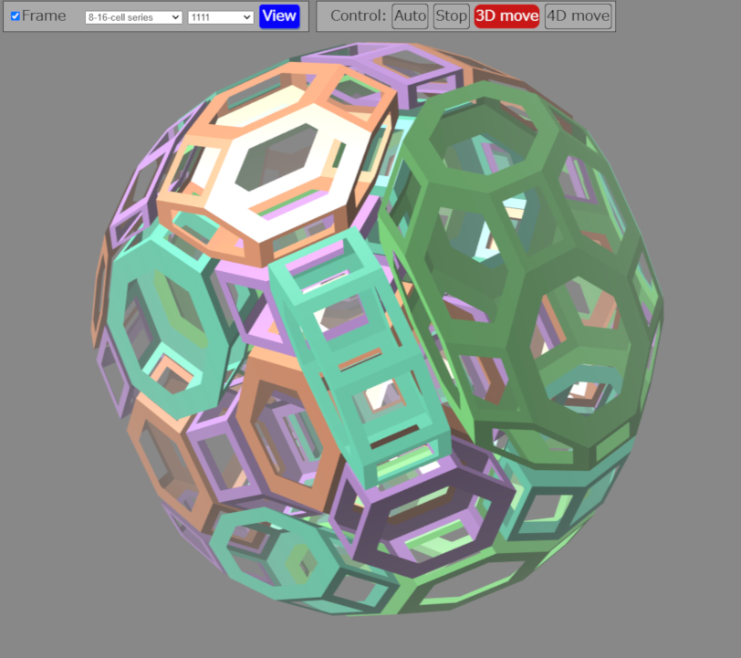

# 4D Polytope Viewer

[日本語の説明はこちら](README.jp.md)

This is a 4D polytope viewer written in TypeScript and three.js. You can view and rotate most 4D convex uniform polytopes.

[](https://youtu.be/hjcY2zeuUDM)

## Getting started

1. [Open the app.](https://satshi.github.io/app/)
2. Click the "View" button.

Then you will see a rotating 4D cube.

## Next steps

### Control

Use the buttons in the "Control" section to change the control mode.

* Auto: It rotates automatically.
* Stop: It stops.
* 3D move: You can rotate in three-dimensional space by dragging the mouse.
* 4D move: You can rotate in four-dimensional space by dragging the mouse.

### Choose another polytope

1. Select a polytope class from the drop-down list on the left.
2. Select a polytope from the drop-down list on the right.
3. Click the "View" button.

Then you will see the polytope.

### Frame view

If you check "Frame" and click the "View" button, the polytope will be displayed in frame mode.

## About polytopes
The Wikipedia page [Uniform 4-polytope](https://en.wikipedia.org/wiki/Uniform_4-polytope) has a good explanation.  The names of polytopes in the "**-cell series" in this app are based on Coxeter diagrams. In this app, 0 corresponds to ● in the Coxeter diagram, and 1 corresponds to ◉. Thus, for example, 0101 in this app corresponds to the Coxeter diagram ●－◉－●－◉.  "Snub" in this app corresponds to ◯－◯－◯－◯.


## Other information

[JSON data format for polytopes](format.md)

## Development

Node.js 22.13.0 or later and pnpm 11.9.0 are required.

```sh
corepack enable
pnpm install --frozen-lockfile
pnpm dev
```

The development server prints the local URL to open. Other commands:

```sh
# Production build in dist/
pnpm build

# Type-check, build, and run all tests
pnpm check

# Preview the production build
